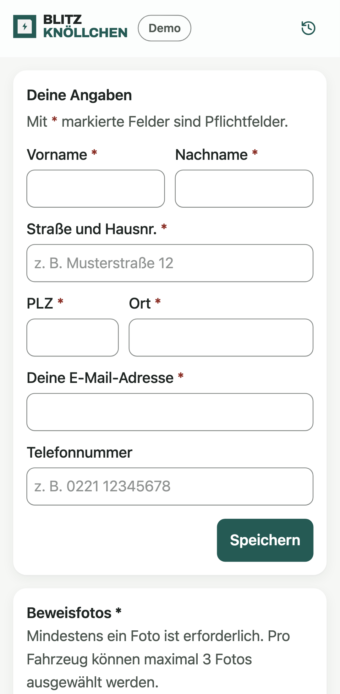
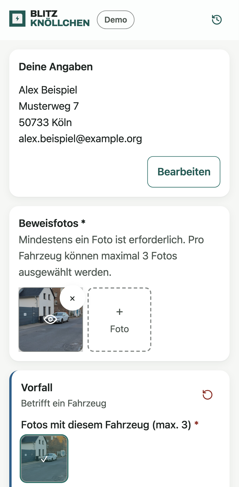
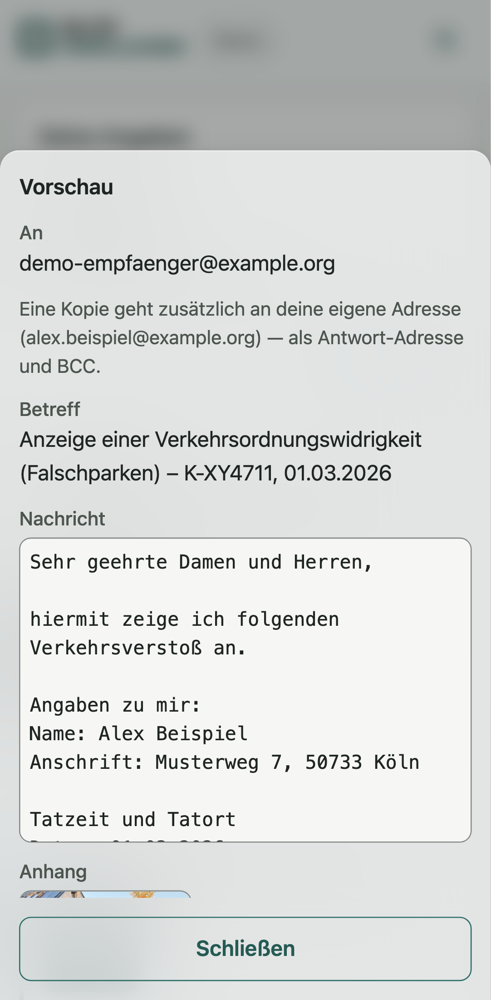
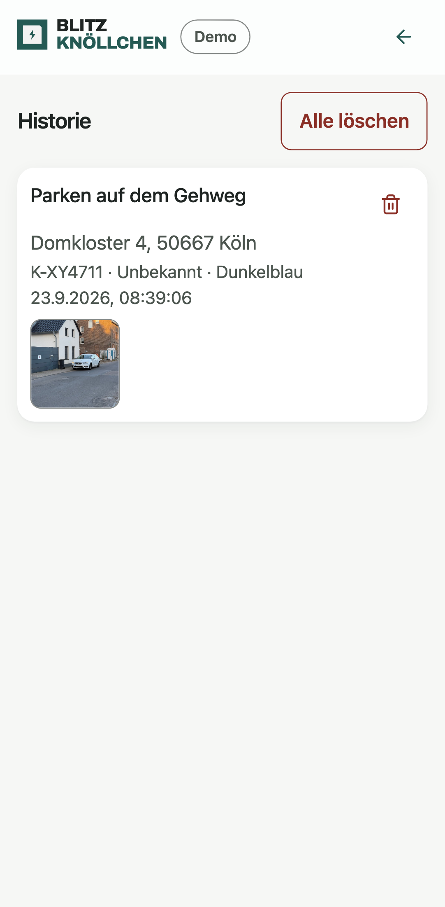

# Blitz-Knöllchen

[](https://github.com/AlexF090/blitz-knoellchen/actions/workflows/ci.yml)

Progressive Web App, mit der sich Falschparker in unter 30 Sekunden vom Smartphone aus bei der
Bußgeldstelle Köln anzeigen lassen — Foto machen, Rest füllt sich selbst aus, absenden.

**→ [Live-Demo](https://blitz-knoellchen.vercel.app)**

<table>
  <tr>
    <td width="25%"></td>
    <td width="25%"></td>
    <td width="25%"></td>
    <td width="25%"></td>
  </tr>
  <tr>
    <td align="center"><sub>Anzeige starten</sub></td>
    <td align="center"><sub>Auto-Fill aus dem Foto</sub></td>
    <td align="center"><sub>Vorschau vor dem Versand</sub></td>
    <td align="center"><sub>Lokale Historie</sub></td>
  </tr>
</table>

## Warum die App existiert

Die Stadt Köln hat für Fremdanzeigen ein
[Online-Formular](https://formular-server.de/Koeln_FS/findform?shortname=32-F68_AnzVerkOrdWi&formtecid=3&areashortname=send_html).
Es funktioniert, aber es ist für genau einen Vorgang gebaut: Wer drei falsch geparkte Autos in
einer Straße meldet, füllt es dreimal komplett aus — jedes Mal inklusive der eigenen
Kontaktdaten, des Tatorts, von Datum und Uhrzeit. Auf dem Smartphone, im Stehen, neben dem Auto.

Blitz-Knöllchen dreht diesen Ablauf um:

- **Mehrere Vorgänge in einem Durchgang.** Fotos landen in einem gemeinsamen Pool und werden
  Fahrzeugen zugeordnet. Jedes Fahrzeug wird als eigene Anzeige verschickt — durchnummeriert, damit
  die Sachbearbeitung die Vorgänge auseinanderhalten kann — aber es ist nur _ein_ Ausfüllvorgang.
- **Die eigenen Daten werden einmal eingegeben.** Danach liegen sie im Gerät und füllen jede
  weitere Anzeige automatisch vor.
- **Tatort und Zeitpunkt kommen aus dem Foto.** Aufnahmedatum und GPS-Position stehen in den
  EXIF-Daten; die Adresse ermittelt die App per Reverse-Geocoding. Getippt werden muss nur noch,
  was das Foto nicht hergibt: Kennzeichen, Fahrzeugart, Farbe, Verstoßart.
- **Kein Medienbruch.** Keine Mail-App, kein manuelles Anhängen von Fotos, kein Abtippen von
  Koordinaten.

## Ablauf in der App

1. **Foto aufnehmen oder auswählen.** Aufnahmedatum und GPS-Position werden aus den EXIF-Daten
   gelesen — auch bei iPhone-HEIC-Fotos, die dafür clientseitig zu JPEG konvertiert werden.
2. **Adresse per Reverse-Geocoding.** Aus den Koordinaten ermittelt die App Straße, Hausnummer,
   PLZ und Ort. Fehlt das GPS-Tag oder schlägt das Geocoding fehl, wird das Adressfeld editierbar
   (mit Autocomplete beim Nachbessern).
3. **Verstoß erfassen.** Eine oder mehrere Verstoßarten, Halte- oder Parkverstoß (inklusive der
   Mindestparkzeit-Regel), Kennzeichen, Fahrzeugart, Marke und Farbe.
4. **Vorschau und Absenden.** Die fertige E-Mail lässt sich vor dem Versand ansehen. Verschickt
   wird sie serverseitig über Brevo, mit komprimiertem Foto im Anhang, in das Datum und GPS wieder
   eingebettet werden. Der Melder bekommt automatisch eine Kopie.
5. **Historie.** Versendete Anzeigen liegen lokal auf dem Gerät (IndexedDB) inklusive Thumbnail —
   nachschlagbar, ohne dass je ein Server sie speichert.

Die App ist als installierbare PWA gebaut und verhält sich vom Homescreen aus wie eine native App.

## Tech-Stack

| Bereich      | Technologie                                                              |
| ------------ | ------------------------------------------------------------------------ |
| Framework    | SvelteKit 2, Svelte 5 (Runes-Modus), TypeScript im `strict`-Modus        |
| Styling      | Tailwind CSS 4, Design-Tokens ausschließlich in `oklch()`                |
| Tests        | Vitest (Node- + echtes Browser-Projekt), Playwright (Desktop und Mobile) |
| Daten        | IndexedDB über `idb` — keine serverseitige Datenhaltung                  |
| Externe APIs | Brevo (E-Mail-Versand), LocationIQ mit BigDataCloud als Fallback         |
| Build/Deploy | Vite 8, `@sveltejs/adapter-vercel`, PWA über `@vite-pwa/sveltekit`       |

Acht Runtime-Dependencies insgesamt — jede einzelne ist in den Architekturentscheidungen
begründet. Die 13 ADRs, die Ordnerstruktur und die Coding-Konventionen stehen in
[`docs/architektur.md`](./docs/architektur.md).

### Umsetzungsdetails

- **Kein Mocking-Framework.** E2E-Tests laufen gegen einen selbst geschriebenen Brevo-Mock
  (`e2e/mocks/brevo-mock-server.mjs`), sodass der echte Versand-Endpunkt inklusive Validierung und
  E-Mail-Aufbau durchlaufen wird — ohne dass eine Mail das Haus verlässt.
- **Ein Netzwerk-Guard in den E2E-Fixtures** lässt jeden nicht explizit gemockten externen Request
  den Test hart fehlschlagen — keine falsch-grünen Tests durch echte API-Aufrufe.
- **Coverage-Thresholds als Regressions-Floor**, mit datei-spezifischen Ausnahmen, die jeweils
  begründen, warum ein Zweig strukturell nicht erreichbar ist (`vite.config.ts`).
- **CSP ohne `unsafe-inline` für Skripte** über SvelteKits `kit.csp`, inklusive dokumentierter
  Begründung, warum Trusted Types hier (noch) nicht aktiviert ist.

## Demo- und Live-Modus

Beim ersten Laden fragt ein blockierender Dialog, ob im **Demo-Modus** (die Anzeige geht an eine
interne Test-Adresse) oder im **Live-Modus** (die Anzeige geht tatsächlich an die Bußgeldstelle)
gearbeitet wird. Die Wahl gilt pro Browser-Session und lässt sich jederzeit über das Modus-Badge
im Header ändern. Welcher Empfänger dahintersteht, entscheidet ausschließlich der Server — der
Client schickt nur `demo` oder `live`, und ein fehlender oder manipulierter Wert fällt immer auf
`demo` zurück.

## Voraussetzungen

- Node.js ≥ 24 und npm ≥ 11 (Version in [`.nvmrc`](./.nvmrc), mit nvm: `nvm use`)
- Ein [Brevo](https://brevo.com)-Account (das kostenlose Kontingent reicht zum Ausprobieren)
- Ein [LocationIQ](https://locationiq.com)-Account (kostenlos, 5.000 Anfragen/Tag)

## Setup

```bash
npm install
cp .env.example .env
```

`.env` mit echten Werten füllen (siehe [Umgebungsvariablen](#umgebungsvariablen)). Die Datei steht
in `.gitignore` und darf nie committet werden.

### Brevo einrichten

1. Account auf [brevo.com](https://brevo.com) anlegen, API-Key erzeugen (Settings → SMTP & API →
   API Keys) → `BREVO_API_KEY`.
2. `EMAIL_FROM` muss eine Adresse einer **selbst besessenen Domain** sein, die in Brevo unter
   „Senders & IPs → Domains" per SPF-/DKIM-DNS-Records authentifiziert wurde. Anders als bei
   manchen Anbietern gibt es keine kostenlose Sandbox-Absenderadresse. Eine fremde Adresse
   (Gmail, GMX, iCloud …) funktioniert nicht: ohne eigenen DNS-Zugriff scheitert die
   DMARC-Alignment-Prüfung bei strengen Empfängern. Begründung im ADR „E-Mail-Versand über Brevo"
   in [`docs/architektur.md`](./docs/architektur.md).
3. `RECIPIENT_EMAIL_DEMO` auf eine eigene Test-Adresse setzen, `RECIPIENT_EMAIL_LIVE` auf die
   tatsächliche Adresse der Bußgeldstelle (`bussgeldstelle@stadt-koeln.de`).

### LocationIQ einrichten

Account auf [locationiq.com](https://locationiq.com) anlegen, Access Token erzeugen →
`LOCATIONIQ_API_KEY`. Der kostenlose Tarif erlaubt 5.000 Anfragen pro Tag bei 2 Anfragen pro
Sekunde; der Server drosselt zusätzlich auf eine Anfrage pro Sekunde.

Schlägt LocationIQ fehl (Rate-Limit, Dienst nicht erreichbar), fällt das Reverse-Geocoding
automatisch auf [BigDataCloud](https://www.bigdatacloud.com/) zurück — kostenlos und ohne Key,
allerdings nur orts- statt hausnummerngenau. Für das Autocomplete gibt es keinen Fallback; dort
bleibt die Vorschlagsliste im Fehlerfall einfach leer.

## Entwicklung

```bash
npm run dev         # Dev-Server
npm run check       # Typprüfung (svelte-check)
npm run lint        # Prettier --check + ESLint
npm run format      # Prettier --write
npm run test:unit   # Vitest (Unit- und Komponententests)
npm run test:e2e    # Playwright (baut und startet die App automatisch)
npm run test        # test:unit + test:e2e
npm run build       # Production-Build
npm run preview     # Production-Build lokal ansehen
```

Ein Husky-Pre-Commit-Hook lässt `lint-staged` laufen (Prettier, ESLint mit `--fix`, Typprüfung).
Die README-Screenshots erzeugt `npm run screenshots` reproduzierbar aus dem Production-Build —
gegen denselben Brevo-Mock wie die E2E-Tests, mit frei erfundenen Testdaten.

## Deployment auf Vercel

Das Projekt nutzt `@sveltejs/adapter-vercel` explizit statt `adapter-auto`.

1. Repository mit Vercel verbinden (SvelteKit wird automatisch erkannt).
2. Unter „Environment Variables" alle fünf Variablen aus `.env.example` eintragen.
3. Deploy auslösen — ein Push auf den verbundenen Branch reicht.

## Umgebungsvariablen

| Variable               | Zweck                                                           |
| ---------------------- | --------------------------------------------------------------- |
| `BREVO_API_KEY`        | API-Key für den E-Mail-Versand über Brevo                       |
| `EMAIL_FROM`           | Feste Absenderadresse (in Brevo authentifizierte eigene Domain) |
| `RECIPIENT_EMAIL_DEMO` | Empfänger im Demo-Modus (eigene Test-Adresse)                   |
| `RECIPIENT_EMAIL_LIVE` | Empfänger im Live-Modus (Bußgeldstelle Köln)                    |
| `LOCATIONIQ_API_KEY`   | Access-Token für Reverse-Geocoding und Adress-Autocomplete      |

## Installation auf dem Smartphone

**Android (Chrome):** Beim Öffnen erscheint automatisch ein Install-Banner. Alternativ über das
Chrome-Menü (⋮) → „App installieren".

**iOS/iPadOS (Safari):** iOS kennt kein automatisches Install-Prompt, daher zeigt die App einen
Hinweis-Banner am unteren Rand: „Teilen" (⬆️) → „Zum Home-Bildschirm". Das funktioniert **nur in
Safari**, nicht in Chrome oder Firefox auf iOS.

## Sicherheit

Schwachstellen bitte nicht als öffentliches Issue melden — siehe [`SECURITY.md`](./SECURITY.md).

## Lizenz

Siehe [`LICENSE`](./LICENSE) — alle Rechte vorbehalten. Der Quelltext ist zur Einsichtnahme
öffentlich zugänglich; Nutzungs-, Kopier- oder Weiterentwicklungsrechte werden damit nicht
eingeräumt.

## Asset-Attribution

- `static/signs/zeichen-283-halteverbot.svg`, `static/signs/zeichen-286-parkverbot.svg` — amtliche
  StVO-Verkehrszeichen (Zeichen 283 „Haltverbot", Zeichen 286 „Eingeschränktes Haltverbot").
- Schriftart [Archivo](https://fonts.google.com/specimen/Archivo) über
  [`@fontsource/archivo`](https://www.npmjs.com/package/@fontsource/archivo), lizenziert unter der
  [SIL Open Font License 1.1](https://openfontlicense.org/).
